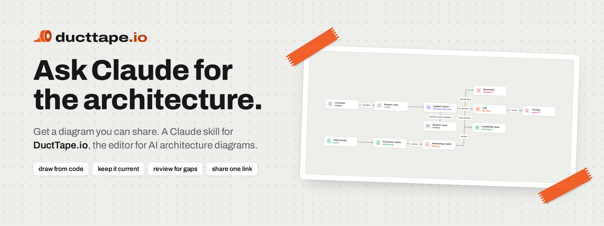
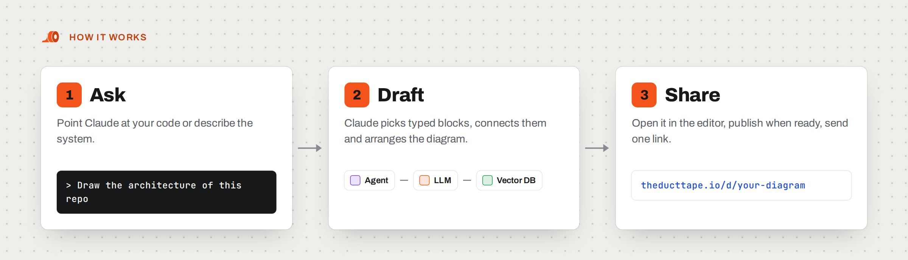
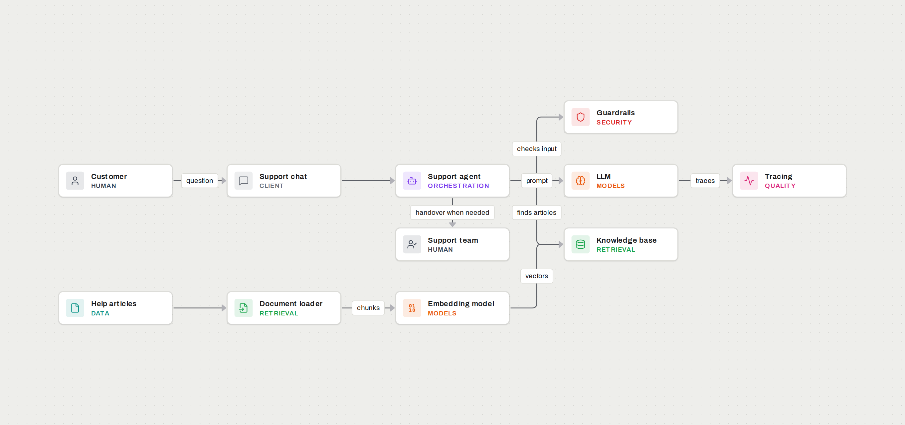
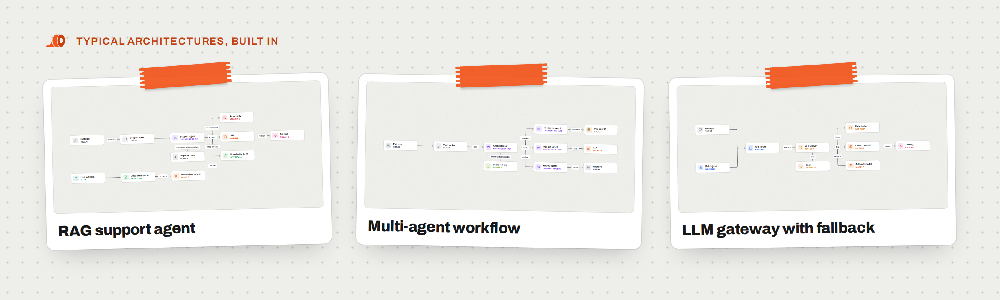

<p align="center">
  <a href="https://theducttape.io">
  <picture>
    <source media="(prefers-color-scheme: dark)" srcset="docs/banner-dark.png">
    
  </picture>
  </a>
</p>

# DuctTape.io skill for Claude

**Ask Claude for the architecture. Get a diagram you can share.**

Your AI stack lives in code, in config files and in three people's heads. This skill lets Claude turn it into a real architecture diagram on [DuctTape.io](https://theducttape.io): typed blocks, labelled connections, one link for everyone who needs to understand it.

No boxes to drag, no arrows to straighten. You describe or point at the code, Claude draws.

<p align="center">
  <picture>
    <source media="(prefers-color-scheme: dark)" srcset="docs/how-dark.png">
    
  </picture>
</p>

## What you can ask

**"Draw the architecture of this repository."**
Claude reads the entry points, model calls, vector stores, queues and tools, and hands you a diagram of how a request really flows.

**"We added a reranker and a fallback model. Update the diagram."**
Claude reads the existing diagram, tells you what will change, and updates the draft once you say go. The diagram stops being the thing nobody maintains.

**"Review this: what is missing?"**
A second pair of eyes for guardrails, tracing, fallbacks, auth, secrets, evals and where personal data travels. You get the gaps that matter for this system, not a generic checklist.

**"Explain this diagram to a new teammate."**
Claude walks along the path of a request, from the user to the answer.

**"Give me a starting point for a RAG with an agent on top."**
Typical architectures are built in: RAG, agents with tools, gateways with fallback. Start from one and make it yours.

**"Sketch three options so we can compare them."**
Each one becomes its own diagram. Decide with pictures instead of paragraphs.

## What comes out

<p align="center">
  <a href="https://theducttape.io/d/HNnyikUTbawl">
  <picture>
    <source media="(prefers-color-scheme: dark)" srcset="docs/rag-support-agent-dark.png">
    
  </picture>
  </a>
</p>

<p align="center"><sub>A real result. Click it to open the interactive diagram.</sub></p>

- **A diagram that knows what it shows.** 56 block types across 13 categories, from LLM, vector DB and agent to MCP server, guardrails and human in the loop. Every block knows what it is, so diagrams stay consistent and readable.
- **Your vendors, where they belong.** 85 vendors in the catalog. Claude names one only where your system really uses it.
- **A link into the editor.** Move things around, add detail, change your mind. It is your diagram.
- **One fixed link to share.** Publish when you are ready. Whoever opens the link needs no account, and the same link shows the new version whenever you publish an update.

## Two ways to work

| | With a connection | Without |
|---|---|---|
| Setup | An access token and one command | None |
| What Claude does | Creates and updates drafts right in your account | Writes a diagram file |
| What you get | A link to the editor | A file for "Import from JSON" |

Either way Claude works on drafts only. Publishing and deleting stay with you.

## Install in two minutes

### Claude Code

```sh
git clone https://github.com/DuctTape-io/ducttape-skill.git
mkdir -p ~/.claude/skills
cp -r ducttape-skill/skills/ducttape ~/.claude/skills/
```

That is it. Claude picks the skill up as soon as a diagram comes up.

### Claude app

Download `ducttape-skill.zip` from the [latest release](https://github.com/DuctTape-io/ducttape-skill/releases/latest) and upload it in the settings, in the skills section. Skills need code execution there.

### Connect your account (optional, recommended)

Create an access token in the [settings](https://theducttape.io/app/settings) of your free DuctTape.io account, then:

```sh
claude mcp add --transport http ducttape https://theducttape.io/api/mcp --header "Authorization: Bearer dtp_..."
```

From now on "draw this" ends with a link instead of a file. The full guide is at [theducttape.io/claude-skill](https://theducttape.io/claude-skill).

## What is inside

| Path | Content |
|---|---|
| `skills/ducttape/SKILL.md` | Workflows and limits |
| `skills/ducttape/reference/modelling.md` | Which block for what, how to label connections, typical architectures, the review checklist |
| `skills/ducttape/reference/catalog.json` | Block types and vendors, generated from the app's own catalog |
| `skills/ducttape/scripts/prepare-diagram.mjs` | Checks a diagram file and arranges the blocks. Node.js 18 or later, no dependencies |

The script also works on its own:

```sh
node skills/ducttape/scripts/prepare-diagram.mjs graph.json "My diagram.json"
```

`graph.json` holds `{ "nodes": [{ "id", "kind", "label"? }], "edges": [{ "source", "target", "label"? }] }`.

## See what a result looks like

<p align="center">
  <a href="https://theducttape.io/examples">
  <picture>
    <source media="(prefers-color-scheme: dark)" srcset="docs/gallery-dark.png">
    
  </picture>
  </a>
</p>

Ten reference architectures as interactive diagrams: [theducttape.io/examples](https://theducttape.io/examples).

## Versions and license

The version is in the front matter of `SKILL.md`. This repository mirrors the skill that ships with the app; changes are made there and published here.

[MIT](LICENSE), copyright TheDuctTape.io. Vendor names in the catalog are trademarks of their respective owners.
